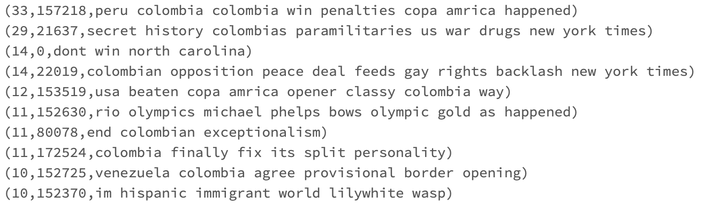
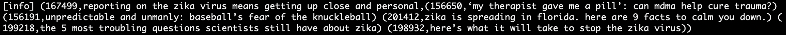

# Project 3 – Big Data / Spark: Text Mining for news processing

## Team Members
* Ronald Cardona Martínez - rcardo11@eafit.edu.co - [VIDEO](https://youtu.be/7U9vJoTYjyQ)

* Alex Montoya Franco - amonto69@eafit.edu.co - [VIDEO](https://youtu.be/BGAoTrefk7M)

* Camila White Romero - cwhiter@eafit.edu.co - [VIDEO](https://youtu.be/fm_rNciNsLE)

## Dev Environment: DataBricks

## Notebook: 
[Cleaning Datasets notebook](https://databricks-prod-cloudfront.cloud.databricks.com/public/4027ec902e239c93eaaa8714f173bcfc/4563577665867992/4335491689515567/3374974215419580/latest.html)

[Inverted Index notebook](https://databricks-prod-cloudfront.cloud.databricks.com/public/4027ec902e239c93eaaa8714f173bcfc/4563577665867992/228514116036715/3374974215419580/latest.html)

[Similar News notebook](https://databricks-prod-cloudfront.cloud.databricks.com/public/4027ec902e239c93eaaa8714f173bcfc/4563577665867992/228514116036684/3374974215419580/latest.html)

## Technical Details

### Simple Spark self-contained app.
* Build using SBT and **Java 8** 
* Don't forget to `unzip "src/main/resources/all-the-news/*.zip"`

## Methodology: CRISP-DM

## Cross Industry Standard Process for Data Mining


## Phases:

1. Business Understanding
    * Understanding of the project goals and requirements.
    * Definition of the Data Mining problem.
2. Data Understanding
    * Acquisition of the initial dataset.
    * Exploration of the dataset.
    * Identify the quality characteristics of data.
3. Data Preparation
    * Data Choosing.
    * Data Cleaning.
4. Modeling
    * Implementation on Data Mining Tools.
5. Evaluation
    * Determine if results meets with project goals.
    * Identify the project topics that should be covered.
6. Deployment
    * Install the models on practice.

## Business Understanding

### Context: 

Text mining or text analytics are a model, techniques, algorithms and technologies sets which allow us to process text of Non-structured nature.

Text mining allow us to transform text into a structured form, so that it will be easier a serie of application such as search in text, relevance of documents, natural understanding of language (NLP), automatic translation between languages, analysis of feelings, detection of topics among many other applications.

Perhaps the simplest processing of all, be the wordcount, which is to determine the frequency of the word per document or the entire dataset.

### Problem:

### First Part: Data Preparation

The news must be pre-processed to prepare the data for the analytics, within the preparation suggestions are:

1. Remove special characters ( . , % ( ) ‘ “ ….
2. Remove stop-words
3. Remove words of longitude 1

### Second Part: An easy search tool based on the inverted index.

The inverted Index is a data structure that contains the following structure:

| Word          | News list (5 news of major frequency)    |
| ------------- |:-------------:|
| word1      | [(news1,f1), (news11,f11),(news4,f4),(news10,f10), … (news50,f50) ] |
| word2      | [(news2,f2), (news14,f14),(news1,f1),(news20,f20), … (news3,f3) ]      |
| word3      | [(news50,f50), (news1,f1),(news11,f11),(news21,f21), … (news2,f2) ]      |
| ... | ... |
| wordN| |

In the inverted index you will have the frequency of each word in the title + description.

Where for each word that is entered by keyboard in the Notebook, list in descending order by word frequency in the content "<"title">" of the news, the most relevant news. List max 5 "<"frec, news_id, title">".

frec = frequency of the word in the news "<"id">" (include title and description)
id = id of the news
title = title of the news

Enter the word (\quit to exit): house

10,17283, House Republicans Fret About Winning Their Health Care Suit
8,17295, Mar-a-Lago, the Future Winter White House and Home of the Calmer Trump
6, 17330, House Republicans, Under Fire, Back Down on Gutting Ethics Office
…


### Third Part: News clustering based on similarity.

Carry out clustering of news using one of different algorithms and models of clustering or similarity,in such a way that allows any news to identify that other news are similar.

It is proposed to use a metric / similarity function based on the intersection of the most common words for each news, it is suggested to have 10 most frequent words for news whose frequency is greater than 1.

| News          | Top 10 of words most frequent per news (without stop-words)   |
| ------------- |:-------------:|
| News1 | [(word1,f1), (word11,f11),(word4,f4),(word10,f10), … (word50,f50) ] |
| News2 | [(word2,f2), (word14,f14),(word1,f1),(word20,f20), … (word3,f3) ] |
| News3 | [(word50,f50), (word1,f1),(word11,f11),(word21,f21), … (word2,f2) ] |
| ... | ... |
| NewsM | |

Where for each news_id that you enter by keyboard in the Notebook, list in descending order of similarity the 5 news most related to said news_id.

id = id of the news
title = title of the news
List_news_id = news related list

Enter the news_id (\quit to exit): 17295

17295, Mar-a-Lago, the Future Winter White House and Home of the Calmer Trump, [17330,
17283, 15234, 14432, 13564]

## Databricks Notebook - Scala

```scala
import org.apache.spark.rdd.RDD
import org.apache.spark.sql.types.{IntegerType, StringType, StructField, StructType}
import org.apache.spark.sql._
import org.apache.spark.sql.expressions.UserDefinedFunction
import org.apache.spark.{SparkConf, SparkContext}
import org.apache.spark.sql.functions.udf
import org.apache.spark.sql.functions._
import org.apache.spark.ml.feature.{StopWordsRemover, Tokenizer}
import spark.implicits._
```

## Data Understanding

### Acquisition of the initial dataset

```scala
val rawDf: DataFrame = spark
        .read
        .option(key = "header", value = "true")
        .option(key = "encoding", value = "UTF-8")
        .option(key = "sep", value = ",")
        .option(key = "inferSchema", value = "true")
        .csv("dbfs:///FileStore/tables/all-the-news/*.csv")
        .withColumn("title", lower($"title"))
        .withColumn("content", lower($"content"))
        .select($"id".cast(IntegerType).as("id"), $"title", $"content")
```

### Exploration of the dataset
Show the result of transforming input files into a DataFrame, analyze its columns and its values.
```scala
rawDF.show()
```

### Identify the quality characteristics of data
As a text mining project the most important quality issue is based on the text quality by itself, stop words, punctuation marks, white spaces, and so on.
In addition to this it was found empty rows in the dataset.


## Data Preparation

### Data Choosing
When the input files are transformed into a DataFrame we eliminate the columns that are no relevant for this project, the columns that have been chosen to stay are: Id, Title, Content.

### Data Cleaning

For this step, special characters, stopwords and words of length one were removed.

* The special characters were removed with the following regular expressions.
  ```
  [^a-z\\sA-Z]
  ```
* The stopwords were removed with the Tokenizer and StopWordsRemover libraries from Spark ML.
* The words of length one were also removed with regular expressions.
  ```
  [!-~]?\\b[\\w]\\b[!-~]?
  ```
A Dataframe was created with an id column and the title and content columns already clean.

```scala
val stop_words: Array[String] = Array("a", "about", "above", "across", "after", "afterwards", "again", "against", "all", "almost", "alone", "along", "already", "also", "although", "always", "am", "among", "amongst", "amoungst", "amount", "an", "and", "another", "any", "anyhow", "anyone", "anything", "anyway", "anywhere", "are", "aren’t", "around", "as", "at", "back", "be", "became", "because", "become", "becomes", "becoming", "been", "before", "beforehand", "behind", "being", "below", "beside", "besides", "between", "beyond", "bill", "both", "bottom", "but", "by", "call", "can", "cannot", "can’t", "co", "con", "could", "couldn’t", "cry", "de", "describe", "detail", "do", "don’t", "done", "down", "due", "during", "each", "eg", "eight", "either", "eleven", "else", "elsewhere", "empty", "enough", "etc", "even", "ever", "every", "everyone", "everything", "everywhere", "except", "few", "fifteen", "fify", "fill", "find", "fire", "first", "five", "for", "former", "formerly", "forty", "found", "four", "from", "front", "full", "further", "get", "give", "go", "had", "has", "hasn’t", "have", "haven’t", "he", "hence", "her", "here", "hereafter", "hereby", "herein", "hereupon", "hers", "herself", "him", "himself", "his", "how", "however", "hundred", "i", "ie", "if", "in", "inc", "indeed", "interest", "into", "is", "it", "it’s", "itself", "keep", "last", "latter", "latterly", "least", "less", "ltd", "made", "many", "may", "me", "meanwhile", "might", "mill", "mine", "more", "moreover", "most", "mostly", "move", "much", "must", "my", "myself", "name", "namely", "neither", "never", "nevertheless", "next", "nine", "no", "nobody", "none", "noone", "nor", "not", "nothing", "now", "nowhere", "of", "off", "often", "on", "once", "one", "only", "onto", "or", "other", "others", "otherwise", "our", "ours", "ourselves", "out", "over", "own", "part", "per", "perhaps", "please", "put", "rather", "re", "same", "see", "seem", "seemed", "seeming", "seems", "serious", "several", "she", "should", "show", "side", "since", "sincere", "six", "sixty", "so", "some", "somehow", "someone", "something", "sometime", "sometimes", "somewhere", "still", "such", "system", "take", "ten", "than", "that", "the", "their", "them", "themselves", "then", "thence", "there", "thereafter", "thereby", "therefore", "therein", "thereupon", "these", "they", "thick", "thin", "third", "this", "those", "though", "three", "through", "throughout", "thru", "thus", "to", "together", "too", "top", "toward", "towards", "twelve", "twenty", "two", "un", "under", "until", "up", "upon", "us", "very", "via", "was", "we", "well", "were", "what", "whatever", "when", "whence", "whenever", "where", "whereafter", "whereas", "whereby", "wherein", "whereupon", "wherever", "whether", "which", "while", "whither", "who", "whoever", "whole", "whom", "whose", "why", "will", "with", "within", "without", "would", "yet", "you", "your", "yours", "yourself", "yourselves")
```

```scala
case class Article(id: Int, title: String, content: String) extends Serializable
```

```scala
//Tokenize title
val titleTokenizer = new Tokenizer().setInputCol("title").setOutputCol("title_tokenized")
val tk = new Tokenizer().setInputCol("title")
val adf = tk.transform(rawDf.na.drop(Array("title")))
val titleTokenized: DataFrame = titleTokenizer.transform(adf)

```

```scala
//Remove stopwords from title
val titleRemover: StopWordsRemover = new StopWordsRemover()
    .setInputCol("title_tokenized")
    .setOutputCol("cleanTitle")
    .setStopWords(stop_words)
val titleDF: DataFrame = titleRemover.transform(titleTokenized)

```

```scala
//Tokenize content
val contentTokenizer = new Tokenizer().setInputCol("content").setOutputCol("content_tokenized")
val tk1 = new Tokenizer().setInputCol("content")
val bdf = tk1.transform(titleDF.na.drop(Array("content")))
val contentTokenized: DataFrame = contentTokenizer.transform(bdf)

```

```scala
//Remove stopwords from content
val contentRemover: StopWordsRemover = new StopWordsRemover()
  .setInputCol("content_tokenized")
  .setOutputCol("cleanContent")
  .setStopWords(stop_words)
val contentDF: DataFrame = contentRemover.transform(contentTokenized)

```

```scala
//Create new dataframe with id column and the title and content columns already without stopwords.
val newsDF: DataFrame = contentDF.select($"id", $"cleanTitle".alias("title"), $"cleanContent".alias("content"))

```

```scala
//Function to remove special chars 
def removeSpecialChars(content: Seq[String]): String  = {
  content.mkString(" ")
         .replaceAll("[^a-z\\sA-Z]", "")
}
val removeSpecialCharsUdf: UserDefinedFunction = udf(removeSpecialChars _)
```

```scala
//Function to remove single chars
def removeSingleChars(content: String): String = {
  content.replaceAll("[!-~]?\\b[\\w]\\b[!-~]?", " ")
}
val removeSingleCharsUdf: UserDefinedFunction = udf(removeSingleChars _)
```

```scala
//Function to remove white spaces
def removeWhiteSpaces(content: String): String = {
  content.trim.replaceAll(" +"," ")
}
val removeWhiteSpacesUdf: UserDefinedFunction = udf(removeWhiteSpaces _)
```

```scala
//Create new dataframe with id column and the title and content columns already clean.
val df: DataFrame = newsDF.withColumn("title", removeSpecialCharsUdf($"title"))
                          .withColumn("content", removeSpecialCharsUdf($"content"))
                          .withColumn("title", removeSingleCharsUdf($"title"))
                          .withColumn("content", removeSingleCharsUdf($"content"))
                          .withColumn("title", removeWhiteSpacesUdf($"title"))
                          .withColumn("content", removeWhiteSpacesUdf($"content"))
```

## Modeling

### Inverted Index

```scala
// Build inverted index.
val articlesRDD: RDD[Article] = df.rdd
  .map(i => Article(i.getAs[Int](0), i.getAs[String](1), i.getAs[String](2)))
```

```scala
val invertedIndex: RDD[(String, List[(Int, Int)])] = (for {
  article <- articlesRDD
  text = article.title + article.content
  word <- text.split(" ")
  } yield (word, (article.id, 1)))
  .groupByKey()
  .mapPartitions{
    _.map {
      case(word, list) =>
          (word, list.groupBy(_._1).map(
            pair => (pair._1, pair._2.map(
              _._2).sum
            )
          ).toList.sortWith((k1, k2) => k1._2 > k2._2))
    }
  }.cache() // Save RDD in memory.

```

```scala
// Online
val search = "Colombia".toLowerCase

val titles: Map[Int, String] = articlesRDD
    .map(article => (article.id, article.title))
    .collect()
    .toMap

val result: (String, List[(Int, Int)]) = invertedIndex
    .filter(_._1 == search)
    .collect()
    .toList.head

val table: List[(Int, Int, String)] = for {
      i <- result._2
      //title = titles.filter(titles("id") === i._1)
      title = titles(i._1)
    } yield (i._2, i._1, title)

```


```scala
// Group news by similarity
val newsIndex: RDD[(Int, List[(String, Int)])] = (for {
  article <- articlesRDD
  text = article.title + article.content
  word <- text.split(" ")
} yield (article.id, (word, 1)))
  .groupByKey()
  .mapPartitions{
    _.map {
      case(id, list) => (id, list.groupBy(_._1).map(
        pair => (pair._1, pair._2.map(
          _._2).sum
        )
      ).toList
       .sortWith((k1, k2) => k1._2 > k2._2)
       .take(10))
    }
  }.cache() // Save RDD in memory.

```

### News Clustering

```scala
val news_id: Int = 167499
```

```scala
//Take the news thar we are looking for
val inNews: (Int, List[(String, Int)]) = newsIndex.filter(_._1 == news_id).first
//Take the other news
val newsRDD: RDD[(Int, List[(String, Int)])] = newsIndex.filter(_._1 != news_id)
```

```scala
//Similarity function to compare two given articles
def sim(i: (Int, List[(String, Int)]), j: (Int, List[(String, Int)])): (Int, Int, Int) = {
  
  //words in common
  val intersect: List[String] = i._2.map(_._1).intersect(j._2.map(_._1)) 
  
  //Union between list i and list j
  val total: List[(String, Int)] = i._2 union j._2

  //Total freq --> of all words
  val distance: Int = total.filter(pair => intersect.contains(pair._1)) match {
    case Nil => 0
    case x => x.reduce((elem1, elem2) => (
    elem1._1, elem1._2 + elem2._2))._2 // How to sum consecutive elements.
  }
  
  //id.  totalFreq number of words in common
  (j._1, distance, intersect.length)
}
```

```scala
val simil: DataFrame = {
  newsRDD.map(x => sim(inNews, x))
  .toDF
  .select($"_1".alias("id"), $"_2".alias("distance"), $"_3".alias("n_words"))
}
```

```scala
val sorted: Array[Int] = simil.sort(desc("n_words"), desc("distance"))
                              .select($"id")
                              .take(5)
                              .map(_.getInt(0))
```

```scala
val cluster: (Int, String, Array[Int]) = (news_id, titles(news_id), sorted)

print(news_id, titles(news_id), sorted.mkString(" "))

```

## Evaluation
To test the code of the inverted index, we looked for the word Colombia.
The following picture shows the result of this step.



To test the code of the news similarity, we looked for the news id 167499.
The following picture shows the result of this step.



It can be shown that the news entered is related to Zika and the 5 similar news, most of them also talk about Zika.

## Deployment

### The project is deployed in Databricks with the publication of the Scala Notebook.
